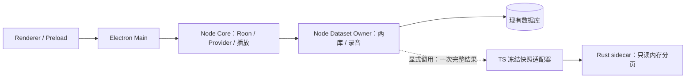

# RUST-001 — 可选 Rust 只读快照端点

Rust Core 第一阶段已完成本地软件验证：新增独立 Rust 进程、TS 适配器、冻结协议和自动 Gate。明确调用方可以把 Node 的完整收藏结果冻结为快照，再经 DatasetOwnerEndpoint 接口读取 Rust 分页。正式应用继续使用原 Node Core 和数据库作者，本期没有迁移用户数据或替换默认运行路径。

基线：MusicBridge V3.7 / MBR-004 最终报告 HEAD `2392b8f69836f02e39ce58f6e6e6e2563c6cc5d4`。
实现提交：`79743f2cbb6afabff719cc38df61ead977415f25`；分支 `codex/rust-core-001-readonly-sidecar`。
报告提交按 `git log -1 --format=%H -- reports/RUST-001_READONLY_SIDECAR.md` 解析；下一任务从本报告最终 HEAD 建立，并另立具体范围。

工作树 `/Volumes/LifeWeave/VSCode/MusicBridge/worktree/rust-core-001`。根工作区继续保持 `codex/fix-playback-read-tracing` / `2392b8f`；原 `apps/desktop/test-results/`、`worktree/` 保留。报告提交另含原生 README 和机器状态收口。

## 实现与接入

- [Rust 内核](../native/rust-core/src/lib.rs) 只持有公开 CollectionModel 数组，处理 prepare / commitBoot / dispatch / close；没有 SQLite、网络、凭据或音频依赖。每帧 4 MiB、最多 2,000 型号、65,536 请求，最后序列位留给关闭。
- [TS facade](../packages/bridge-core/src/rust-core/readonly-sidecar.ts) 实现现有 DatasetOwnerEndpoint，只准入无筛选 collection.list，公开 readOnly / snapshotId / capabilities。它是显式工厂及接口接缝，没有作为完整 208 命令 Owner 注入生产组合。
- 每次读取核验 epoch / datasetId / snapshotId / requestId / sequence / operation；合法 DTO 还须与冻结快照对应页一致。16 在途上限、串行 stdin 背压和单调期限阻止阻塞后的过期派发/迟到回执；异常后不自动重放。
- 私有 null 回执恢复成既有 Promise<void>。关闭先封入口并等已接受操作，同时要求 close ACK 与自然 child close(code=0, signal=null)；强杀或超时不得成功返回。
- 二进制由明确的绝对路径与 SHA-256 固定，启动及正常关闭复核，不查 PATH 或启用 shell；子进程仅得到 LANG，stderr 只消费。此处没有证明 OS 沙盒或分发签名。
- [协议 v1](../docs/contracts/rust-readonly-sidecar-v1.md)、[ADR-038](../docs/adr/ADR-038-rust-readonly-sidecar.md)、[任务](../tasks/RUST-001-readonly-sidecar.md)、机器状态与风险已补齐；新增 [Rust Gate](../scripts/ci/verify-rust-core.mjs) 及 macOS/Linux CI，原 verify 与默认 App 入口保持原行为。

虚线支路由明确调用方建立；本期实际集成测试使用合成 Node 两库 Owner。应用默认启动没有创建该支路。

## 数据范围

保留 Node 结果顺序、ID、null、缺省可选字段、库存数量及照片元数据，不重新排序或重算历史 hash。Node 后续写入不会修改旧快照，刷新需创建新端点。

freezeCollectionSnapshot 只接受一次完整公开页；现有每页最多 100 型号，故帮助函数只能捕获不超过 100 型号的完整结果。factory 接受调用方独立保证完整性的最多 2,000 型号数组；本期 2,000 型号来自合成完整数组，没有实现活跃大库的原子全量导出。

协议接受严格 JSON 子集：拒绝自定义原型、访问器、toJSON、重复键、非安全整数和孤立 UTF-16 代理项；collectorPolicy 必须是枚举字符串，旧公开校验器 String(value) 意外接受数组的行为没有被改动。合法 -0 按 JSON 语义归一化为 0，不写回原库或重算历史。有效中文与补充平面字符已由实际 Rust 进程验证，不能宣称所有旧 JS 校验器可能接受的值都与 Rust 等价。

## 新鲜验证

Node 22.23.2、pnpm 10.17.1、Rust/Cargo 1.95.0；本机使用 stable 选择器，Gate 验证实际版本与 pin 精确一致。构建、缓存、tmp 和日志都在已核验挂载且可写的外置 LifeWeave。

| 检查 | 最终结果 |
| --- | --- |
| Rust fmt / clippy -D warnings / locked Release 构建 | 退出均 0 |
| Rust 协议及实际进程测试 | 16 通过，0 失败/忽略，退出 0 |
| TS fake 故障和生命周期 | 25/25，退出 0 |
| 实际固定 Rust 二进制集成 | 5/5，0 跳过，退出 0 |
| Contracts 完整原规格 | 254/254，退出 0 |
| Core 完整原规格 + 25 新例 | 2032 通过，0 失败，原 2 条件跳过，退出 0 |
| Desktop 完整原规格 | 1239/1239，退出 0 |
| 全项目 typecheck，含 Vue 与 E2E TS | 退出 0 |
| 全项目 production build | 退出 0 |
| control-plane / boundaries / cycles | 退出均 0 |
| git diff --check | 退出 0 |

Node 三包合计 **3525 通过、0 失败、原 2 条件跳过**；25 项 fake 已计入 Core，不重复加总。16 项 Rust 和 5 项实际 Rust 集成单独记录。各包完整范围与标准 test 脚本的 test/*.test.ts 相同，显式 --test-concurrency=1，没有新增 skip 或缩减规格；类型、完整单元、构建分层执行，未声称运行过根 pnpm verify 总进程。

最后两项修复后重跑完整 Core、全项目类型/构建及静态 Gate。Contracts/Desktop 源码和规格没有修改，保留本期已通过的完整结果。软件检查前后 989 文件清单稳定；Rust Gate 的 276 文件与实际二进制前后固定并再次核验。协议、ADR 和任务等文档另由实现提交文件摘要绑定；README 已在受测清单中，随报告提交。

实际集成覆盖：Node Worker 两库接收三种合成库存 → 一次完整页 → Rust 结果一致；Node 后续写入不污染旧快照；2,000 型号分页/并发读取、中文及补充平面字符/null/可选照片；空快照、自然关闭、实际 SIGKILL 后停止发布；合法负零往返仍可读取并关闭。

固定 Release 二进制：`/Volumes/LifeWeave/Developer/CommandLine/tmp/mb-rust-core-001-w4lk0F/cargo-target/release/musicbridge-rust-core`。
SHA-256：`0d8bc499c06f05b7efcd70f47b4dee6450cc0ae83cc1fb0a45877826ec6e0465`。这是本机 macOS arm64 开发产物，未作安装包或发布验收。

精确 argv、退出码、日志摘要、工具链和源码/二进制清单见 [RUST-001_EVIDENCE.json](RUST-001_EVIDENCE.json)。主证据目录 `/Volumes/LifeWeave/Developer/CommandLine/tmp/mb-rust-core-001-w4lk0F`；最终 Rust manifest 为 `/Volumes/LifeWeave/Developer/CommandLine/tmp/mb-rust-core-001-w4lk0F/rust-gate/run-RB1E0i/manifest.json`。新 CI 已配置，尚未推送及远端执行。

## 审查与失败证据

Owner 最后放宽为最多 4 子代理。本期实际使用 4 个 gpt-6.1-sol/high，主代理 gpt-6.1-sol/max；平台并发额度不足时分批运行，主代理整合及验证，不改变全局模型配置。

审查修复了单调期限、覆盖式重复键、toJSON/原型改写、负零误判和策略数组。最后两例在修复前均失败（final-edge-red.log 退出 1、2 失败），修复后完整 fake、实际 Rust 及 Core 通过。

初次 Rust Gate 因过度拒绝 serde 等必要 build.rs 退出 1，失败日志保留；现在仅准入锁定 JSON 依赖的必要构建脚本。Gate 同时增加源码前后指纹、每次独立结果目录，以及 mkdir 前后真实路径核验。早期默认 Node 25 的检查不作为最终证据，已由显式 Node 22 的最新检查替代。

原始 [参考会话](https://chatgpt.com/share/6abf2e64-df0c-83ee-b7e2-772435b2d141) 未返回可读正文，没有把其内容当作当前代码结论。当前范围依据 Owner 的明确指令、MBR-004 最终基线和实际实现。

## 后续升级与保留项

| 建议下一阶段 | 准入前需冻结并证明的行为 |
| --- | --- |
| 原子快照与完整只读查询 | Node Owner 版本/事实一致；活跃 2,000 型号导出、筛选/排序；编码/复制/校验/完整调用成本 |
| 测量后选择纯计算内核 | 与优化后的 TS 解析、指纹或对象审计用相同输入差分比较，取得收益再扩大范围 |
| 完整 Dataset Owner 分模块移植 | 两库事务、208 命令、幂等/unknown、原 JSON/BLOB/hash、激活/关闭、旧库与回退兼容；只准入一个写入所有者 |
| 默认启用与分发 | 包内资源/身份/签名、进程树监督、实际包启动/崩溃恢复/自然退出、完整 Electron 和对应 Owner 验收 |

这些是规划，未开始写入迁移、SDK/播放/录音迁移或默认切换。本期没有性能对照，不能宣称 Rust 已加速。

MBR-004 真实 Roon 根因与恢复仍未确认；真实 Provider/Roon、录音/Gate B/P4/P5、Owner 接受、完整 Electron E2E、系统钥匙串、安装替换、真实迁移、远端 CI、push/main 合并及发布均 **NOT_RUN**。自动软件 Gate 不覆盖这些结论。接续开发后等待 heartbeat 已暂停，避免重复启动。
